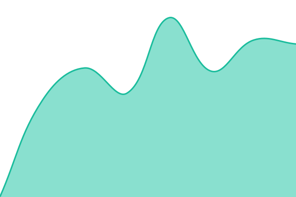
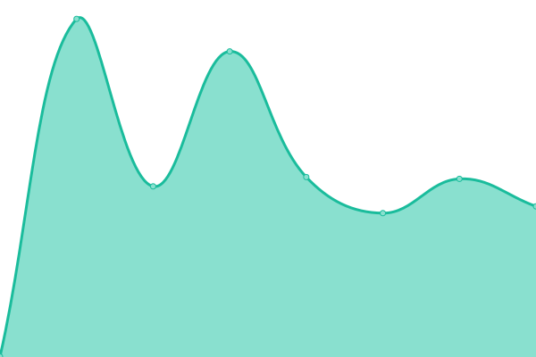
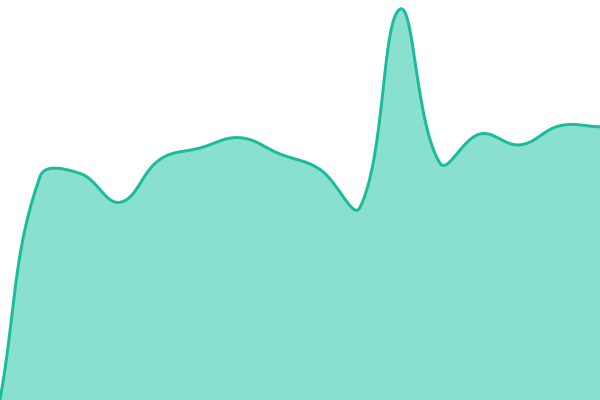

# [📈 Live Status](https://jessicaroh.github.io/uptime/): <!--live status--> **🟧 Partial outage**

<!--start: status pages-->
<!-- This summary is generated by Upptime (https://github.com/upptime/upptime) -->
<!-- Do not edit this manually, your changes will be overwritten -->
<!-- prettier-ignore -->
| URL | Status | History | Response Time | Uptime |
| --- | ------ | ------- | ------------- | ------ |
|  [Habaneros](https://habaneros.ch) | 🟥 Down | [habaneros.yml](https://github.com/jessicaroh/uptime/commits/HEAD/history/habaneros.yml) | 

 347ms
     
 | 

<a href="https://jessicaroh.github.io/uptime/history/habaneros">0.00%</a>
    

|  [Garage Union](https://garageunion.ch) | 🟩 Up | [garage-union.yml](https://github.com/jessicaroh/uptime/commits/HEAD/history/garage-union.yml) | 

 2249ms
     
 | 

<a href="https://jessicaroh.github.io/uptime/history/garage-union">96.20%</a>
    

|  [Boucherie La Lienne](https://boucherielalienne.ch) | 🟩 Up | [boucherie-la-lienne.yml](https://github.com/jessicaroh/uptime/commits/HEAD/history/boucherie-la-lienne.yml) | 

 1952ms
     
 | 

<a href="https://jessicaroh.github.io/uptime/history/boucherie-la-lienne">97.81%</a>
    

|  [Pascal Héritier](https://pascal-heritier.ch) | 🟥 Down | [pascal-heritier.yml](https://github.com/jessicaroh/uptime/commits/HEAD/history/pascal-heritier.yml) | 

 348ms
     
 | 

<a href="https://jessicaroh.github.io/uptime/history/pascal-heritier">0.00%</a>
    

|  [RR Jantes](https://rrjantes.ch) | 🟥 Down | [rr-jantes.yml](https://github.com/jessicaroh/uptime/commits/HEAD/history/rr-jantes.yml) | 

 0ms
     
 | 

<a href="https://jessicaroh.github.io/uptime/history/rr-jantes">0.00%</a>
    

|  [AF Conseils](https://afconseils.ch) | 🟩 Up | [af-conseils.yml](https://github.com/jessicaroh/uptime/commits/HEAD/history/af-conseils.yml) | 

 1238ms
     
 | 

<a href="https://jessicaroh.github.io/uptime/history/af-conseils">96.30%</a>
    

|  [S1](https://s1.stevenroh.ch) | 🟩 Up | [s1.yml](https://github.com/jessicaroh/uptime/commits/HEAD/history/s1.yml) | 

 567ms
     
 | 

<a href="https://jessicaroh.github.io/uptime/history/s1">100.00%</a>
    

|  [S2](https://s2.stevenroh.ch) | 🟩 Up | [s2.yml](https://github.com/jessicaroh/uptime/commits/HEAD/history/s2.yml) | 

 587ms
     
 | 

<a href="https://jessicaroh.github.io/uptime/history/s2">100.00%</a>
    

|  [S3](https://s3.stevenroh.ch) | 🟥 Down | [s3.yml](https://github.com/jessicaroh/uptime/commits/HEAD/history/s3.yml) | 

 0ms
     
 | 

<a href="https://jessicaroh.github.io/uptime/history/s3">0.00%</a>
    

|  [H](https://h.stevenroh.ch) | 🟩 Up | [h.yml](https://github.com/jessicaroh/uptime/commits/HEAD/history/h.yml) | 

 1001ms
     
 | 

<a href="https://jessicaroh.github.io/uptime/history/h">1.75%</a>
    

<!--end: status pages-->

[**Visit our status website →**](https://jessicaroh.github.io/uptime/)

## 📄 License

- Powered by: [Upptime](https://github.com/upptime/upptime)
- Code: [MIT](./LICENSE) © [Upptime](https://upptime.js.org)
- Data in the `./history` directory: [Open Database License](https://opendatacommons.org/licenses/odbl/1-0/)
